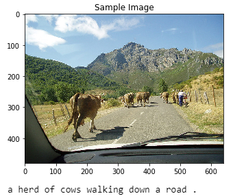
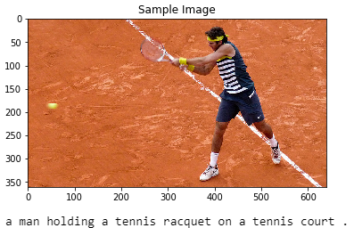
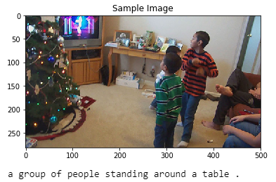
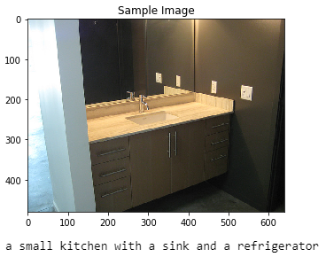

# CVND---Image-Captioning-Project

# Instructions  
1. Clone this repo: https://github.com/cocodataset/cocoapi  
```
git clone https://github.com/cocodataset/cocoapi.git  
```

2. Setup the coco API (also described in the readme [here](https://github.com/cocodataset/cocoapi)) 
```
cd cocoapi/PythonAPI  
make  
cd ..
```

3. Download some specific data from here: http://cocodataset.org/#download (described below)

* Under **Annotations**, download:
  * **2014 Train/Val annotations [241MB]** (extract captions_train2014.json and captions_val2014.json, and place at locations cocoapi/annotations/captions_train2014.json and cocoapi/annotations/captions_val2014.json, respectively)  
  * **2014 Testing Image info [1MB]** (extract image_info_test2014.json and place at location cocoapi/annotations/image_info_test2014.json)

* Under **Images**, download:
  * **2014 Train images [83K/13GB]** (extract the train2014 folder and place at location cocoapi/images/train2014/)
  * **2014 Val images [41K/6GB]** (extract the val2014 folder and place at location cocoapi/images/val2014/)
  * **2014 Test images [41K/6GB]** (extract the test2014 folder and place at location cocoapi/images/test2014/)

4. The project is structured as a series of Jupyter notebooks that are designed to be completed in sequential order (`0_Dataset.ipynb, 1_Preliminaries.ipynb, 2_Training.ipynb, 3_Inference.ipynb`).


## Method:

[The Dataset notebook](0_Dataset.ipynb) initializes the [COCO API](https://github.com/cocodataset/cocoapi) (the "pycocotools" library) used to access data from the MS COCO (Common Objects in Context) dataset, which is "commonly used to train and benchmark object detection, segmentation, and captioning algorithms." The notebook also depicts the processing pipeline using the following diagram:


The left half of the diagram depicts the "EncoderCNN", which encodes the critical information contained in a regular picture file into a "feature vector" of a specific size. That feature vector is fed into the "DecoderRNN" on the right half of the diagram (which is "unfolded" in time - each box labeled "LSTM" represents the same cell at a different time step). Each word appearing as output at the top is fed back to the network as input (at the bottom) in a subsequent time step, until the entire caption is generated. The arrow pointing right that connects the LSTM boxes together represents hidden state information, which represents the network's "memory", also fed back to the LSTM at each time step.

[The Preliminaries notebook](1_Preliminaries.ipynb) uses the pycocotools, torchvision transforms, and NLTK to preprocess the images and the captions for network training. It also explores the EncoderCNN, which is taken pretrained from [torchvision.models, the ResNet50 architecture](https://pytorch.org/docs/master/torchvision/models.html#id3).

The implementations of the EncoderCNN, which is supplied, and the DecoderRNN, which is left to the student, are found in the [model.py](model.py) file.

In [the Training notebook](2_Training.ipynb) one finds selection of hyperparameter values and EncoderRNN training. The hyperparameter selections are explained.

[The Inference notebook](3_Inference.ipynb) contains the testing of the trained networks to generate captions for additional images. No rigorous validation or accuracy measurement was performed, only sample images were generated. See below.

## Results:

Four sample images were captioned, two in which the caption matches well, 

  

...and two for which the caption doesn't match quite so well:

  

Steps for additional improvement would be exploring the optional validation task at the end of the training notebook, and also additional training.
